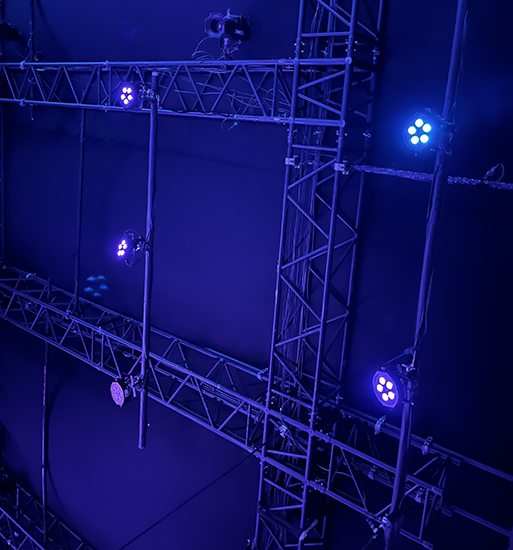
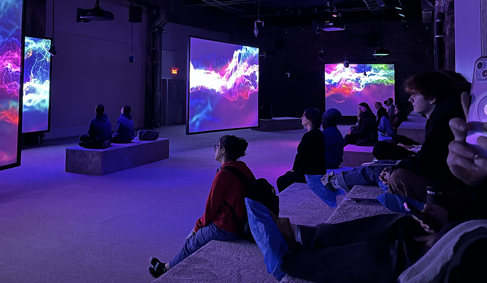
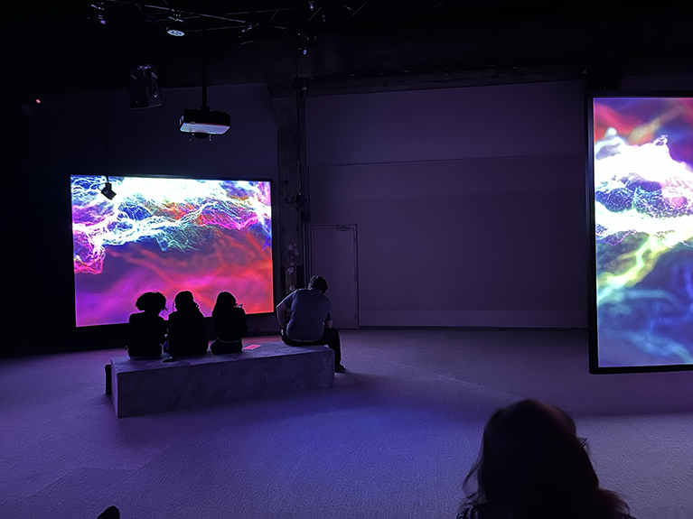

<h1>Jeremy Shaw phase shifting index</h1>
<h2>Fonderie Darling</h2>

L'exposition de Jeremy Shaw "phase shifting" est une oeuvre multimédia basé sur des vidéos, de la musique ainsi que de la lumière.
Nous avons visités cette exposition, originalement créée en 2020, le vendredi 2 février 2024.
Afin de mettre en place cette exposition ils ont eu besoin de projecteurs, toiles afin d'y projetter les vidéos, des hauts parleurs
pour le son, ainsi que de grandes lumières de différentes couleurs pour pouvoir donner un effet psychédélique à la fin de 
l'exposition.

<h2>Disposition</h2>
Les écrans étaient disposés en îlots afin de permettre aux gens de se déplacer au travers de la pièce afin d'aller observer chaque îlot,
les cables ont été placés d'une manière à ce qu'ils ne soient pratiquement pas appercevable.

Les projecteurs étaient placés en hauteur afin d'empêcher de cacher l'écran si quelqu'un passait devant, les hauts parleurs étaient quant à eux placés
un peu partout, près de chaque écrans, afin de vraiment isoler chaque petit îlot avec leur propre son, ce qui permet une meilleure immersion.

<h2>mon exprérience</h2>
Au tout début quand je suis entré dans la pièce, il y avait plusieurs écrans avec des gens qui dansaient de différentes façons, je ne savais pas trop
à quoi m'attendre, je me suis même quasiment endormi à un moment, puis, d'un coup ils se sont tous mis à danser de la même façon.

À ce moment là, ça m'a reveillé d'un coup, la musique qui était propre à chaque écran était désormais coordonnée partout, en observant les écrans, on a pu se 
rendre compte que chacun de ces vidéos ont été filmé à la même époque, contrairement à ce qu'on aurait pu penser puisque chaque vidéo semblait d'une époque
différente.

Par la suite, ils sont tous entrés dans une sorte de trans, avec du data moshing, ce qui rendait la chose assez intéressante, pour ensuite finir sur une sorte de galaxie.
Malgré que j'ai trouvé cela assez simple, j'ai bien aimé mon expérience, ça m'a surpris positivement quand ils se sont tous mis à faire les mêmes mouvements synchronisés, 
mais j'aurais quand même raccourci le moment au début où ils dansent tous de façon différente, j'ai trouvé ce moment un peu trop long avant que l'on entre réellement dans
l'action, mais appart ça, j'ai bien apprécié cette oeuvre multimédia de Jeremy Shaw.

