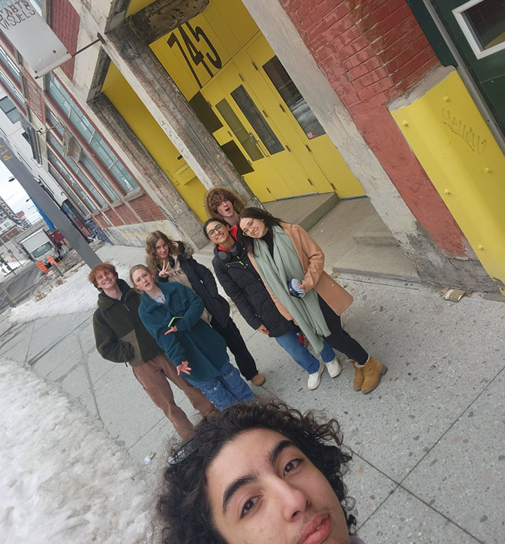
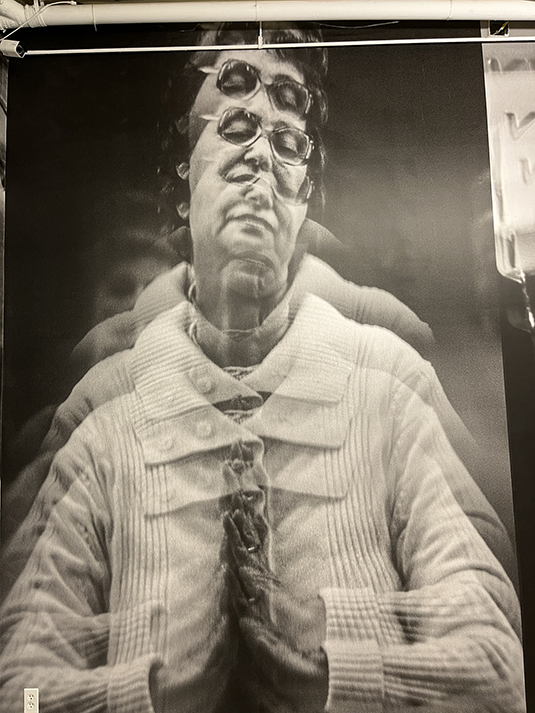
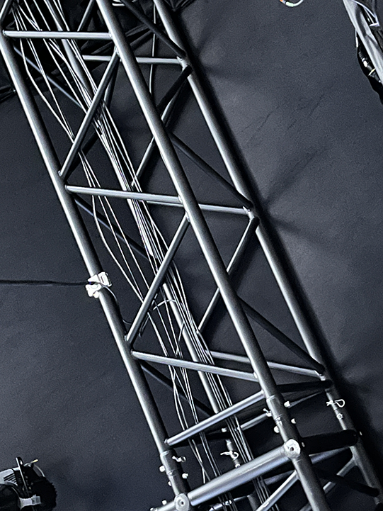
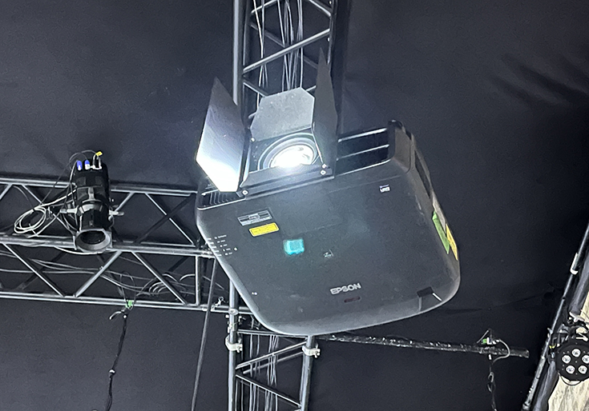
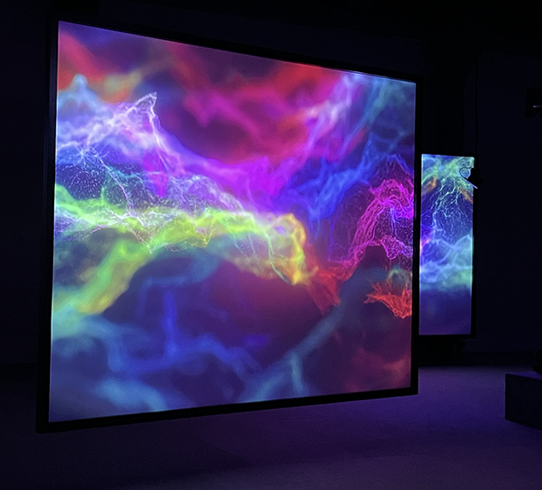

<h1>Jeremy Shaw phase shifting index</h1>
<h2>Fonderie Darling</h2>

L'exposition de Jeremy Shaw "phase shifting" est une oeuvre multimédia basé sur des vidéos, de la musique ainsi que de la lumière.
Nous avons visités cette exposition, originalement créée en 2020, le vendredi 2 février 2024.
Afin de mettre en place cette exposition ils ont eu besoin de projecteurs, toiles afin d'y projetter les vidéos, des hauts parleurs
pour le son, ainsi que de grandes lumières de différentes couleurs pour pouvoir donner un effet psychédélique à la fin de 
l'exposition.

<h2>Disposition</h2>
Les écrans étaient disposés en îlots afin de permettre aux gens de se déplacer au travers de la pièce afin d'aller observer chaque îlot,
les cables ont été placés d'une manière à ce qu'ils ne soient pratiquement pas appercevable.

Les projecteurs étaient placés en hauteur afin d'empêcher de cacher l'écran si quelqu'un passait devant, les hauts parleurs étaient quant à eux placés
un peu partout, près de chaque écrans, afin de vraiment isoler chaque petit îlot avec leur propre son, ce qui permet une meilleure immersion.

